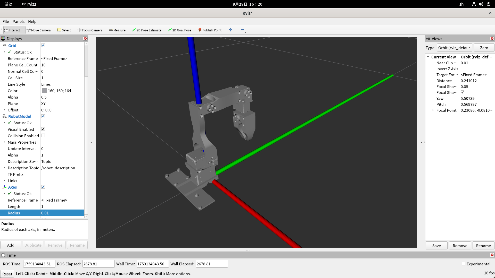

# WOWROBO 机械臂+深度相机项目

## 机械臂坐标定义

以最下面的多级为原点，红色为X轴，绿色为Y轴，蓝色为Z轴。



## 机械臂标定

运行以下命令进行机械臂标定，`--robot.port`参数根据实际情况修改为机械臂连接的串口号，`--robot.calibration_dir`参数指定标定数据保存的目录。

```bash
python lerobot\src\lerobot\calibrate.py --robot.type koch_follower --robot.port COM3 --robot.id koch_follower --robot.calibration_dir calibration/
```

缺什么库装什么库。如果报错找不到lerobot，需要在calibrate.py中前面添加：

```python
import sys
import os

sys.path.append(os.path.dirname(os.path.dirname(__file__)))
```

## 步骤

### 数据收集

#### 物品分类

直接拍摄物品图片，标注物品种类训练YOLO模型。

#### 中国象棋

先用相机拍摄包含棋盘的图片，标注棋子种类和位置。训练好YOLO模型后，识别棋盘时根据角点先矫正棋盘，再输入YOLO模型识别，以便定位棋子在棋盘中的位置。
